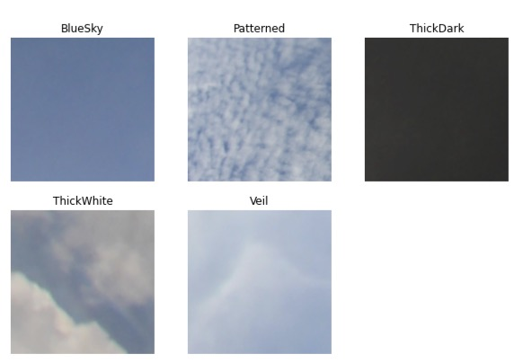
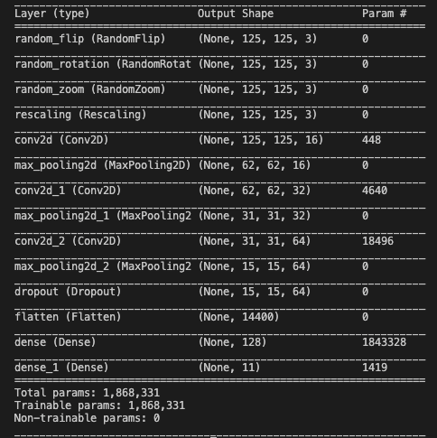
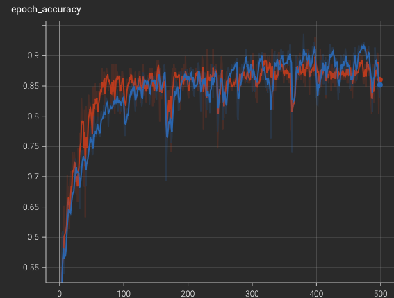
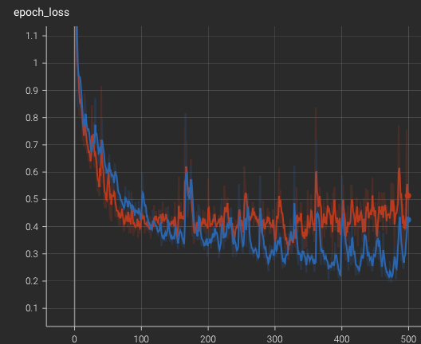

# Classifying Clouds in The Clouds

In this repo we:
    - Train and deploy a Sagemaker TensorFlow model to classify pictures from the Singapore Whole sky IMaging CATegories (SWIMCAT) dataset. 
    - Create a Flask application that allows its users to take a picture of the sky and classifies it using this communicate with this model.

The dataset is avaliable at this [link](http://vintage.winklerbros.net/swimcat.htm) and below are some example pictures:

## Model
The preparation and uploading of the images is carried out by the image_prep.py script and the TF model is specified in the training.py script. Below is the structure of the model used for training:

 

 

The model's training can be evaluated using TensorBoard on a local server using this following bash command:

    S3_REGION=YOUR_REGION tensorboard --logdir=s3://PATH_TO_LOGS

This returned the following accuracy and loss plots (blue line specifies training and orange validation).

  
   

The model can then be deployed using:

    predictor = estimator.deploy(initial_instance_count=1, instance_type=instance_type)

## App
Then using Flask we create an app that interacts with the deployed model to classify the image.

The upload route (in the application.py script) and Ajax logic (in the index.html script) passes the image from the front end to the back end for prediction, then passes the predicted value to the front end for the displayed prediction. 

## All Together
The final product isn't too bad! Below is a video example of it in action...

## Final Remarks
Hopefully you find this repo useful and you're welcome to contact me with questions and/or suggestions!

Feel free to check out my [Medium Article](PLACEHOLDERLINK) for a more in depth description of this project!
